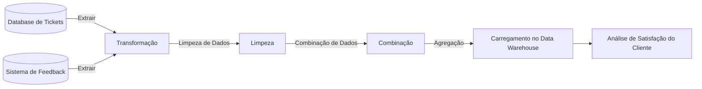

# Arquitetura de Data Pipelines

## Informações Gerais

**Tópico**: Arquitetura de Data Pipelines  
**Tema**: Data Pipelines  

### Introdução (3 min)

- `O que é um Data Pipelines?`

Um Data Pipeline é uma série de processos de dados projetados para *transformar*, *transportar* e *armazenar* dados de uma fonte para um destino.

O processo em um Data Pipeline geralmente começa com a *extração* de dados de fontes diversas, como bancos de dados, sistemas de arquivos, feeds ao vivo ou serviços na nuvem. Após a extração, os dados são *transformados*. Esta transformação pode envolver `limpeza, agregação, enriquecimento, ou outras formas de manipulação para tornar os dados mais úteis e consistentes`. Por fim, os dados transformados são *carregados* em um sistema de armazenamento ou análise, como um Data warehouse ou Data Lake.  Assim temos o conceito de ETL (Extract, Transform, Load). 

### Componentes de um Data Pipeline

- Coleta de dados: Como os dados são adquiridos.
- Processamento de dados: Métodos de transformação dos dados.
- Armazenamento de dados: Onde e como os dados são armazenados.

Dados esse componentes, podemos ter uma visão geral de como um Data Pipeline é construído, abaixo segue um exemplo de tecnologias que podem ser utilizadas para cada componente.

```mindmap 
    root((Data Pipeline))
    Coleta de dados
        AWS
            Amazon Kinesis
                Serviço de streaming de dados em tempo real.
            AWS IoT Core
                Serviço de mensagens para dispositivos IoT.
            Glue
                Serviço de ETL.
        Azure
            Azure Event Hubs
                Serviço de streaming de dados em tempo real.
            Azure IoT Hub
                Serviço de mensagens para dispositivos IoT.
            Azure Data Factory
                Serviço de ETL.
        GCP
            Google Cloud Pub/Sub
                Serviço de mensagens para dispositivos IoT.
            Google Cloud Dataflow
                Serviço de ETL.
    Processamento de dados
        AWS
            Amazon EMR
                Serviço de processamento de dados distribuído.
            AWS Lambda
                Serviço de computação sem servidor.
            AWS Glue
                Serviço de ETL.
            Databricks
                Serviço de processamento de dados distribuído.
        Azure
            Azure HDInsight
                Serviço de processamento de dados distribuído.
            Azure Functions
                Serviço de computação sem servidor.
            Azure Data Factory
                Serviço de ETL.
            Databricks
                Serviço de processamento de dados distribuído.
        GCP
            Google Cloud Dataproc
                Serviço de processamento de dados distribuído.
            Google Cloud Functions
                Serviço de computação sem servidor.
            Google Cloud Dataflow
                Serviço de ETL.
            Databricks
                Serviço de processamento de dados distribuído.
    Armazenamento de dados
        AWS
            Amazon S3
                Serviço de armazenamento de objetos.
            Amazon Redshift
                Serviço de data warehouse.
            Amazon DynamoDB
                Serviço de banco de dados NoSQL.
            Amazon RDS
                Serviço de banco de dados relacional.
        Azure
            Azure Blob Storage
                Serviço de armazenamento de objetos.
            Azure Synapse Analytics
                Serviço de data warehouse.
            Azure Cosmos DB
                Serviço de banco de dados NoSQL.
            Azure SQL Database
                Serviço de banco de dados relacional.
        GCP
            Google Cloud Storage
                Serviço de armazenamento de objetos.
            Google BigQuery
                Serviço de data warehouse.
            Google Cloud Bigtable
                Serviço de banco de dados NoSQL.
            Google Cloud SQL
                Serviço de banco de dados relacional.
```

### Teoria Básica (4 min)

- Data Pipelines no `Mundo Real`. 

Vamos supor que você esteja trabalhando com dados de atendimento ao cliente e queira analisar a satisfação do cliente com base em tickets de suporte.

Aqui está o fluxo de ETL para este cenário:

`Extração (Extract)`: Os dados são extraídos de duas fontes - um banco de dados de tickets de suporte e um sistema de feedback do cliente.

`Transformação (Transform)`: Os dados são limpos (removendo entradas duplicadas, corrigindo erros), combinados (unindo dados de tickets com feedbacks) e agregados (calculando a média de satisfação por produto ou serviço).

`Carregamento (Load)`: Os dados transformados são carregados em um data warehouse para análise e geração de relatórios.



### Demonstrações de Código (6-8 min)
- Apresentação de um exemplo simples de pipeline de dados usando Python.
- Demonstração inclui extração de dados, uma transformação básica e carregamento em um sistema de armazenamento.


### Conceito de ETL
- Explicação do processo ETL (Extract, Transform, Load).

## Recursos Adicionais

- [Exemplo de Código - Arquitetura de Data Pipelines](https://www.notion.so/Exemplo-de-C-digo-Arquitetura-de-Data-Pipelines-a83bf2a8a56a448597227d152d5254b8?pvs=21)

# Bibliografia Referencia

- The Data Warehouse Toolkit: The Definitive Guide to Dimensional Modeling