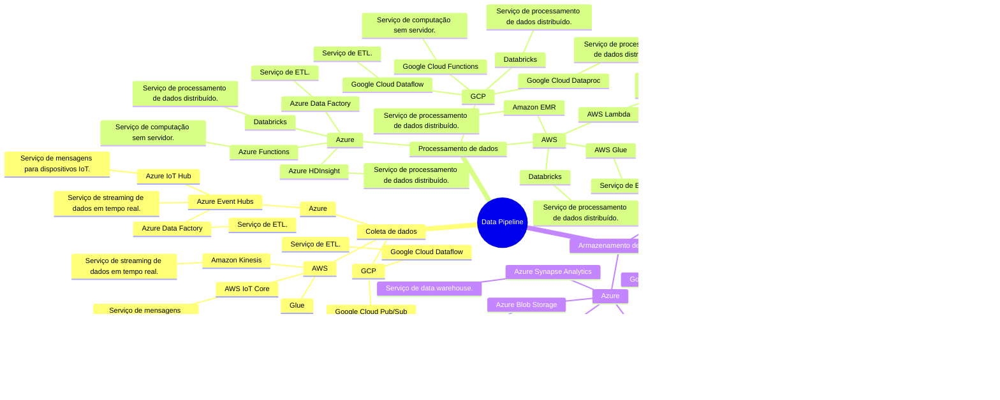

# Arquitetura de Data Pipelines

## Informações Gerais

**Tópico**: Arquitetura de Data Pipelines  
**Tema**: Data Pipelines  

### Objetivos da Aula:
    - Entender o que é um Data Pipeline.
    - Entender os componentes de um Data Pipeline.
    - Entender o conceito de ETL (Extract, Transform, Load).
    - Codificar um exemplo simples de pipeline de dados usando Python.

---

### Introdução (3 min)

 

#### O que é um Data Pipelines?

Um Data Pipeline é uma série de processos de dados projetados para *transformar*, *transportar* e *armazenar* dados de uma fonte para um destino.

 - O processo em um Data Pipeline geralmente começa com a: *extração* de dados de fontes diversas, como bancos de dados, sistemas de arquivos, feeds ao vivo ou serviços na nuvem. 
- Após a extração, os dados são *transformados*. Esta transformação pode envolver `limpeza, agregação, enriquecimento, ou outras formas de manipulação para tornar os dados mais úteis e consistentes`. 
- Por fim, os dados transformados são *carregados* em um sistema de armazenamento ou análise, como um Data warehouse ou Data Lake.  Assim temos o conceito de ETL (Extract, Transform, Load). 

---

### Componentes de um Data Pipeline
 

- `Coleta de dados`: Como os dados são adquiridos.
- `Processamento de dados`: Métodos de transformação dos dados.
- `Armazenamento de dados`: Onde e como os dados são armazenados.

O mapa mental a seguir ilustra a diversidade de tecnologias disponíveis para cada componente de um Data Pipeline. Este mapa fornece uma visão abrangente das tecnologias e ferramentas mais reconhecidas no mercado, facilitando a compreensão de como cada uma se integra ao fluxo geral de um processo ETL.

---

#### Mapa Mental de Tecnologias

---
layout: two-cols
---

<template v-slot:default>

### Ideia Geral do ETL em um GIF

Nesse GIF, podemos ver um fluxo ETL, onde os dados são extraídos, transformados e carregados e assim utilizados para diferentes propósitos.

> [!NOTE] 
> Data Lakes são adequados para armazenar grandes volumes de dados em vários formatos, Data Warehouses são mais focados em armazenar dados estruturados para query e análise. Lake Houses tentam oferecer o melhor dos dois mundos, combinando a versatilidade de um Data Lake com as capacidades de processamento e análise de um Data Warehouse.

</template>
<template v-slot:right>

</template>

---
layout: two-cols
---

<template v-slot:default>

## Exemplo em Mundo Real
 

### Data Pipelines no `Mundo Real`. 

Vamos supor que você esteja trabalhando com dados de atendimento ao cliente e queira `analisar a satisfação do cliente` com base em tickets de suporte.
</template>

<template v-slot:right>

</template>

---

### Fluxo de ETL para este cenário

Aqui está o fluxo de ETL para este cenário:

`Extração (Extract)`: Os dados são extraídos de duas fontes - um banco de dados de tickets de suporte e um sistema de feedback do cliente.

`Transformação (Transform)`: Os dados são limpos (removendo entradas duplicadas, corrigindo erros), combinados (unindo dados de tickets com feedbacks) e agregados (calculando a média de satisfação por produto ou serviço).

`Carregamento (Load)`: Os dados transformados são carregados em um data warehouse para análise e geração de relatórios.

#### Fluxo de ETL
 

---

### Demonstrações de Código (6-8 min)

Vamos criar um cenário de exemplo para um exercício de pipeline ETL com PySpark. Considere um contexto onde você tem um conjunto de dados de vendas de uma loja de varejo. O objetivo é extrair os dados, realizar algumas transformações e, em seguida, carregar os dados transformados para análise posterior.

Contexto do Exercício:

- *Fonte de Dados:* Um arquivo CSV chamado vendas.csv que contém dados de vendas diárias.

- *Colunas do CSV:* Data, ProdutoID, QuantidadeVendida, PrecoUnitario.

- *Objetivo da Transformação:* Calcular o total de vendas (quantidade x preço) por produto e filtrar apenas aqueles produtos cujas vendas totais sejam superiores a um determinado valor. Criando a coluna TotalVendas.

---

## Passo a Passo

1.  Extract (Extrair)

Ler o arquivo vendas.csv usando PySpark.

Criando um script em Python usando Pyspark denominado script_extract.py.py, com uma funcão extract para extrair os dados do CSV. 

Para gerar o arquivo vendas.csv, execute o script generate_vendas_csv.py contido na pasta `slidev/pages/Arquitetura de Data Pipelines/code`

<!-- 
from pyspark.sql import SparkSession

def extract(spark):
    df = spark.read.csv("vendas.csv", header=True, inferSchema=True)
    return df

-->

---

## Passo a Passo

2. Transform (Transformar)

Criar um script denominado script_transform.py com  uma funcão para calcular o total de vendas (quantidade x preço) por produto e filtrar apenas aqueles produtos cujas vendas totais sejam superiores a 10 reais. Criando a coluna TotalVendas.

<!-- 
from pyspark.sql import DataFrame
from pyspark.sql.functions import col

def transform(df: DataFrame):
    df_transformed = df.withColumn("TotalVenda", col("QuantidadeVendida") * col("PrecoUnitario"))
    df_filtered = df_transformed.groupBy("ProdutoID").sum("TotalVenda").filter(col("sum(TotalVenda)") > 10000)
    return df_filtered

-->

---

## Passo a Passo

3. Load (Carregar)

Criar um Script denominado script_load.py para salvar o resultado em um novo arquivo CSV, vendas_transformadas.csv.

<!-- 

def load(df: DataFrame, output_path: str):
    df.write.csv(output_path, header=True)

-->

--- 

## Passo a Passo

3. main.py

Criar um script denominado main.py para executar os scripts anteriores em sequência.

### Fluxo de ETL

<!-- 
from pyspark.sql import SparkSession
from script_extract import extract
from script_transform import transform
from script_load import load

if __name__ == "__main__":
    spark = SparkSession.builder.appName("ETL Pipeline").getOrCreate()

    # Extract
    df = extract(spark)

    # Transform
    transformed_df = transform(df)

    # Load
    load(transformed_df, "vendas_transformadas.csv")

    spark.stop()
-->

--- 

# Bibliografia Referencia

- The Data Warehouse Toolkit: The Definitive Guide to Dimensional Modeling